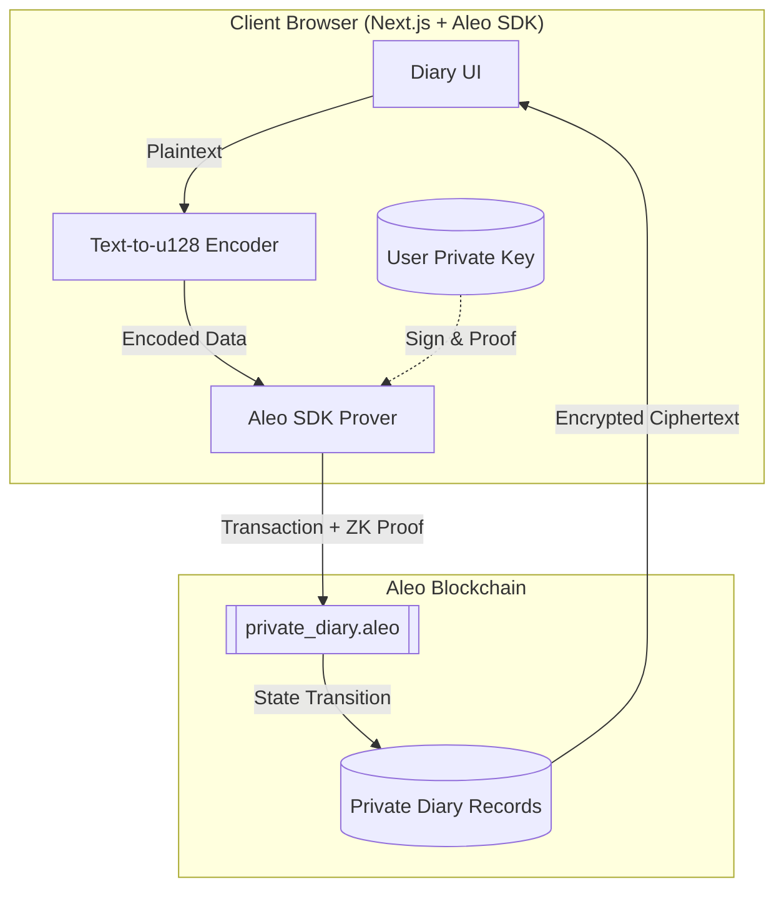

This is a solid stack. Using **Next.js** with the **Aleo Provable SDK** allows you to execute ZK-proofs directly in the user's browser, meaning the plain-text diary entries never even touch a server.

Here is a comprehensive `README.md` including the architectural design and the SDK integration logic.

---

# 🖋️ Inkognito: Private-First Journaling

**Built for the Aleo Blockchain**

Inkognito is a decentralized, zero-knowledge diary application where your thoughts are truly your own. Leveraging Aleo's private-by-default architecture, every entry is encrypted on-chain as a private record. Not even the network validators can read your journal—only you hold the keys to decrypt and view your history.

## 🏗️ Architectural Design

Inkognito uses a "Local-First, Proof-Always" architecture. The Next.js frontend handles the heavy lifting of generating ZK-proofs using the Aleo SDK.



---

## 🛠️ Features

* **Total Privacy:** Entries are stored as Aleo Records, which are encrypted using the owner's public key.
* **ZK-Sharing:** Securely share specific entries with other Aleo addresses without revealing your entire journal.
* **Zero Data Footprint:** No centralized database. Your history lives on-chain, but remains invisible to the public.
* **Gas-Efficient Updates:** Modify entries by consuming old records and creating new ones in a single atomic transaction.

---

## 💻 Tech Stack

* **Smart Contract:** Leo Language
* **Frontend:** Next.js (App Router)
* **SDK:** `@demox-labs/aleo-wallet-adapter` & `@aleohq/sdk`
* **Styling:** Tailwind CSS

---

## 🚀 Smart Contract Overview (`private_diary.aleo`)

The core logic resides in the Leo contract. It defines a `DiaryEntry` record:

```leo
record DiaryEntry {
    owner: address,
    id: u64,
    category: u8,
    timestamp: u32,
    line1: u128, // Encoded text data
    line2: u128,
    line3: u128,
    line4: u128,
}

```

For **Wave 1**, Inkognito utilizes a **Multi-Line Record Structure** (`line1` through `line4`).

While industry standards often point to **IPFS** for large data, we have intentionally chosen native `u128` chunking for this phase to demonstrate **Native ZK Data Integrity**.

### Why On-Chain `u128` Lines?

1. **Native Aleo Encryption:** By storing data in Leo Records, we rely on Aleo’s core protocol to encrypt the diary entries. The plaintext never exists outside of the user's browser or the encrypted record.
2. **ZK-Circuit Mastery:** This approach proves the ability to manipulate and structure data within the constraints of the Leo compiler—a key requirement for advanced Aleo development.
3. **Atomic State Transitions:** Modifying a note is a single on-chain event. This eliminates the "desync" risk where a CID is updated on IPFS but the transaction fails on-chain.

### Data Chunking Logic

Since Leo does not support dynamic strings, the frontend "Inkognito Engine" performs the following:

* **Encoding:** `String` → `UTF-8 Bytes` → `BigInt (u128)`.
* **Storage:** Distributes 16-byte segments across 4 record fields.
* **Decoding:** Fetches the record via **Aleo SDK** → `BigInt` → `Hex` → `String`.

---

## 🏁 Getting Started

1. **Clone the repo:** `git clone https://github.com/embolaweb3/Inkognito`
2. **Install Leo:** Follow the [Aleo Docs](https://docs.leo-lang.org/getting_started/installation).
3. **Deploy:** ```bash
cd contract
leo build
leo deploy --broadcast
```

